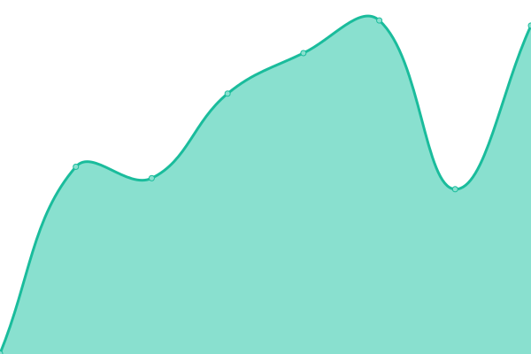

# [📈 Live Status](https://status.lolpros.gg): <!--live status--> **🟩 All systems operational**

This repository contains the open-source uptime monitor and status page for [LOLProsGG](lolpros.gg), powered by [Upptime](https://github.com/upptime/upptime).

With [Upptime](https://upptime.js.org), you can get your own unlimited and free uptime monitor and status page, powered entirely by a GitHub repository. We use [Issues](https://github.com/SpireGG/status-gg/issues) as incident reports, [Actions](https://github.com/SpireGG/status-gg/actions) as uptime monitors, and [Pages](https://status.lolpros.gg) for the status page.

<!--start: status pages-->
<!-- This summary is generated by Upptime (https://github.com/upptime/upptime) -->
<!-- Do not edit this manually, your changes will be overwritten -->
<!-- prettier-ignore -->
| URL | Status | History | Response Time | Uptime |
| --- | ------ | ------- | ------------- | ------ |
|  [LOLProsGG](https://lolpros.gg) | 🟩 Up | [lol-pros-gg.yml](https://github.com/SpireGG/status-gg/commits/HEAD/history/lol-pros-gg.yml) | 

 677ms
     
 | 

<a href="https://status.lolpros.gg/history/lol-pros-gg">100.00%</a>
    

|  [LOLPros BR](https://br.lolpros.gg) | 🟩 Up | [lol-pros-br.yml](https://github.com/SpireGG/status-gg/commits/HEAD/history/lol-pros-br.yml) | 

 1296ms
     
 | 

<a href="https://status.lolpros.gg/history/lol-pros-br">100.00%</a>
    

|  [LOLPros NA](https://na.lolpros.gg) | 🟩 Up | [lol-pros-na.yml](https://github.com/SpireGG/status-gg/commits/HEAD/history/lol-pros-na.yml) | 

 779ms
     
 | 

<a href="https://status.lolpros.gg/history/lol-pros-na">100.00%</a>
    

|  [LOLPros API](https://api.lolpros.gg) | 🟩 Up | [lol-pros-api.yml](https://github.com/SpireGG/status-gg/commits/HEAD/history/lol-pros-api.yml) | 

 492ms
     
 | 

<a href="https://status.lolpros.gg/history/lol-pros-api">100.00%</a>
    

<!--end: status pages-->

[**Visit our status website →**](https://status.lolpros.gg)

## 📄 License

- Powered by: [Upptime](https://github.com/upptime/upptime)
- Code: [MIT](./LICENSE) © [LOLProsGG](lolpros.gg)
- Data in the `./history` directory: [Open Database License](https://opendatacommons.org/licenses/odbl/1-0/)
